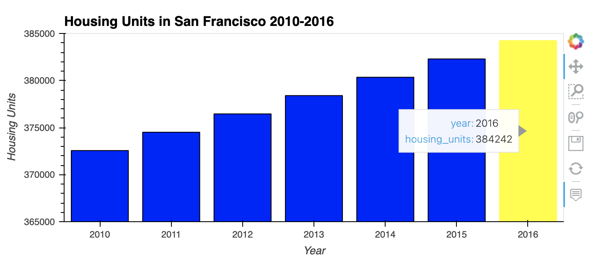

# Module_6 - San Francisco Housing Analysis

   

Proptech, the application of technology to real-estate markets, is an innovative domain in the fintech industry. I an analyst at a proptech company that wants to offer an instant, one-click service for people to buy properties and then rent them. The company wants to have a trial of this offering in the San Francisco real-estate market. If the service proves popular, they can then expand to other markets.

My job is to use my data visualization skills, including aggregation, interactive visualizations, and geospatial analysis, to find properties in the San Francisco market that are viable investment opportunities.

---

## Technologies

This project leverages python 3.7.11 with the following packages:

* [pandas](https://pandas.pydata.org) - Use the Pandas library, along with JupyterLab, to collect, prepare and analyze data.

* [pathlib](https://docs.python.org/3/library/pathlib.html) - This module allows to easily read in csv files.

* [HoloViz (formerly PyViz)](https://holoviz.org) - Data visualization tools hvPlot and GeoViews.

---

## Installation Guide

Before running the application first import the following libraries:

```python
  import pandas as pd
  import hvplot.pandas
  from pathlib import Path
```

Before running, you'll have to install hvplot and geoviews on your computer.

  

---

## Usage

Summary analysis of my data story is included in the Jupyter Notebook.

   

   
    
   
   
   
   
Bonus work!  I couldn't figure out why the Bernal Heights data information was not concatenating with the geographical location data for Bernal Heights, so I broke off into a new Jupyter Notebook under the Resources folder call df_junk.ipynb.  I found that there were 3 other neighborhoods that appeared to be identical, but weren't matching up: Downtown, Ingleside and Outer Richmond as well.  Turns out, the neighborhood name in one of the files had a trailing "space" added to it, so instead of "Bernal Heights" it was "Bernal Heights ".  This means these 4 neighborhoods were excluded from the final interactive map.  I added them back in, on this df_junk notebook only, just to make sure they didn't show any great buying potential.  Neither of them did.  In fact, the interactive map in df_junk looks EXACTLY the same as the one I'm turning in for this challenge assignment (all 4 neightborhoods share coordinates with other neighborhoods that were not excluded).  I'd say it was a waste of time to go back and add them in, but I don't know how many nights of sleep I would have lost wondering why they weren't matching up!!!

---

## Contributors

Starter code was provided by UW Fintech Bootcamp.  Updates and analysis by Jason Buckholt.  

---

## License

MIT License

Copyright (c) 2022 Jason Buckholt

Permission is hereby granted, free of charge, to any person obtaining a copy of this software and associated documentation files (the "Software"), to deal in the Software without restriction, including without limitation the rights to use, copy, modify, merge, publish, distribute, sublicense, and/or sell copies of the Software, and to permit persons to whom the Software is furnished to do so, subject to the following conditions:

The above copyright notice and this permission notice shall be included in all copies or substantial portions of the Software.

THE SOFTWARE IS PROVIDED "AS IS", WITHOUT WARRANTY OF ANY KIND, EXPRESS OR IMPLIED, INCLUDING BUT NOT LIMITED TO THE WARRANTIES OF MERCHANTABILITY, FITNESS FOR A PARTICULAR PURPOSE AND NONINFRINGEMENT. IN NO EVENT SHALL THE AUTHORS OR COPYRIGHT HOLDERS BE LIABLE FOR ANY CLAIM, DAMAGES OR OTHER LIABILITY, WHETHER IN AN ACTION OF CONTRACT, TORT OR OTHERWISE, ARISING FROM, OUT OF OR IN CONNECTION WITH THE SOFTWARE OR THE USE OR OTHER DEALINGS IN THE SOFTWARE.